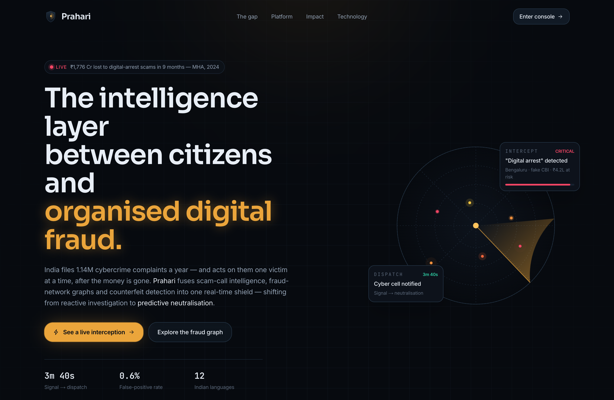
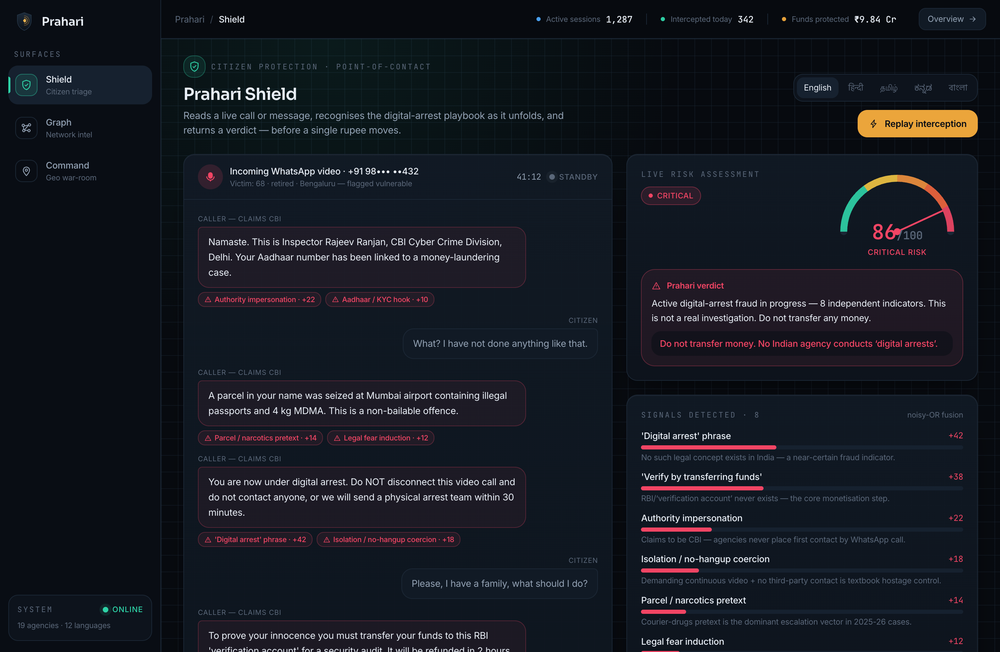
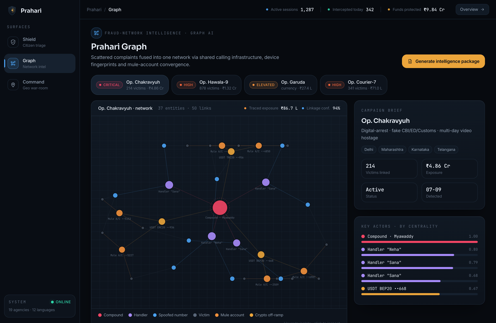
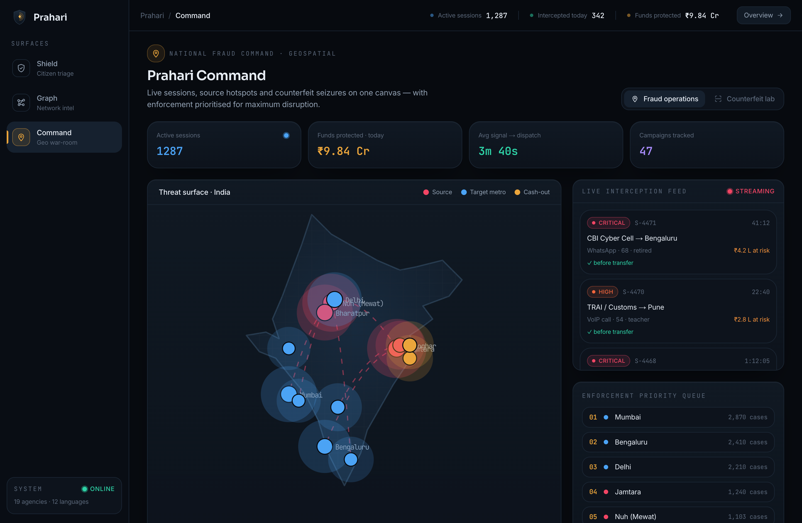
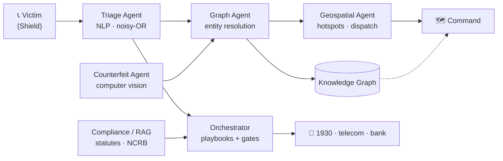

<div align="center">



# प्रहरी · Prahari

### The intelligence layer between citizens and organised digital fraud

[](https://prahari-nine.vercel.app)
[](https://prahari-nine.vercel.app/deck.html)
[](docs/ARCHITECTURE.md)


<sub>ET AI Hackathon 2026 · Problem Statement 6 — AI for Digital Public Safety</sub>

</div>

---

## The problem, in one sentence

India files **1.14 million cybercrime complaints a year** and acts on them **one victim at a time, after the money is gone.** "Digital arrest" scams alone stole **₹1,776 crore in nine months** (MHA, 2024). The data exists — the intelligence layer to act on it *before* mass victimisation does not.

**Prahari** is that layer. It fuses **scam-call intelligence, fraud-network graphs and counterfeit detection** into a single real-time system — shifting public safety from *reactive investigation* to *predictive neutralisation*.

> **One campaign, three surfaces, minutes not months:** a retiree gets a fake-CBI video call → **Shield** flags the digital-arrest script *before any transfer* → the number + mule account feed **Graph**, which clusters 214 scattered complaints into one court-admissible campaign → **Command** maps its national spread and dispatches the nearest cyber cell — while a bank teller gets a **counterfeit-note** flag on the mule's cash.

---

## 🛡 Shield — stops the scam at the point of contact



Reads a live call or message and recognises the digital-arrest playbook **as it unfolds** — authority impersonation, the phrase "digital arrest," isolation coercion, "transfer to verify." A weighted classifier with **noisy-OR fusion** compounds the evidence; the risk gauge crosses **CRITICAL before a single rupee moves**, triggering five orchestrated actions (1930/NCRB, telecom block, bank freeze, family alert) — in 12 languages.

## ◇ Graph — turns one report into the whole network



Entity resolution across numbers, mule accounts and devices fuses scattered complaints into one live fraud network — *Op. Chakravyuh*. Centrality ranks the actors (handlers → mule layer → crypto off-ramp → cross-border command node), and one click generates a **court-admissible intelligence package**: money trail, applicable statutes (BNS, IT Act, PMLA) and a tamper-evident chain-of-custody digest.

## ◈ Command — directs the response across the country



A geospatial war-room over India's real fraud geography (Jamtara, Mewat, Bharatpur): live interception feed, source→target scam-flow arcs, and an **enforcement priority queue** ranking where to deploy for maximum disruption — plus a fourth modality, on-device **computer-vision** authentication of counterfeit ₹500 notes.

---

## How it works

Six specialised agents reason over one shared knowledge graph and coordinate on a signal bus. Every automated action is structured and auditable — never opaque.



**Frontend** Next.js 16 · React 19 · TypeScript · Tailwind v4 (hand-built design system) · bespoke SVG data-viz (force graph, geospatial map, risk gauges).
**AI core (in-repo, runs offline)** weighted classifier + noisy-OR fusion · d3-force graph analytics · counterfeit feature scoring · intelligence-package generation.
**Production target** Python FastAPI agent services · Claude reasoning agents · Neo4j · vector RAG · Kafka signal bus — see **[docs/ARCHITECTURE.md](docs/ARCHITECTURE.md)**.

---

## Why it wins

*Judging: Innovation 25 · Business Impact 25 · Technical Excellence 20 · Scalability 15 · UX 15.*

| Criterion | How Prahari maximises it |
|---|---|
| **Innovation** · 25 | The only entry that *converges* four modalities — voice/NLP, graph, geospatial, CV — into one thread with court-admissible output. |
| **Business Impact** · 25 | India's most topical crime; every screen quantifies rupees protected, grounded in cited 2024–26 figures. |
| **Technical Excellence** · 20 | Real multi-agent core, probabilistic fusion, live force-directed graph, clean production build. |
| **Scalability** · 15 | Stateless surfaces over a shared fabric; per-modality autoscaling; jurisdiction-sharded graph. |
| **User Experience** · 15 | A hand-built "command intelligence" design system — not a template, not a default dashboard. |

---

## Run it locally

```bash
git clone https://github.com/Aman100705/Prahari.git
cd Prahari
npm install
npm run dev            # → http://localhost:3000
```

No API keys, no external services — the entire demo runs **offline** on a seeded dataset grounded in India's real fraud geography.

**Walkthrough:** `/` overview → `/shield` (*Play live interception*, or `?autoplay=1`) → `/graph` (*Generate intelligence package*) → `/command` (map + *Counterfeit lab*). Narrated script in **[docs/DEMO_SCRIPT.md](docs/DEMO_SCRIPT.md)**.

<details>
<summary><b>Project structure</b></summary>

```
src/
  app/
    page.tsx                 # landing / product overview
    (console)/               # product shell (left rail + status strip)
      shield/  graph/  command/
    api/triage/route.ts      # scam classifier endpoint
  components/
    brand/  ui/              # logo + hand-built primitives (no component lib)
    landing/ graph/ command/ # RadarHero · ForceGraph · IndiaMap · CounterfeitPanel
  lib/intel/                 # domain model · seeded dataset · classifier · dossier
docs/                        # architecture · demo script · screenshots
```

</details>

---

<div align="center">

**[▶ Live Demo](https://prahari-nine.vercel.app)** · **[Pitch Deck](https://prahari-nine.vercel.app/deck.html)** · **[Architecture](docs/ARCHITECTURE.md)** · **[Demo Script](docs/DEMO_SCRIPT.md)**

<sub>Prahari · प्रहरी — the sentinel. Built for ET AI Hackathon 2026.</sub>

</div>
