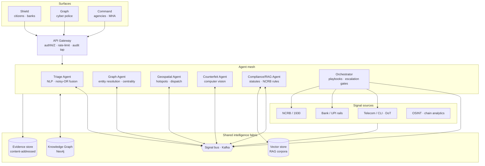
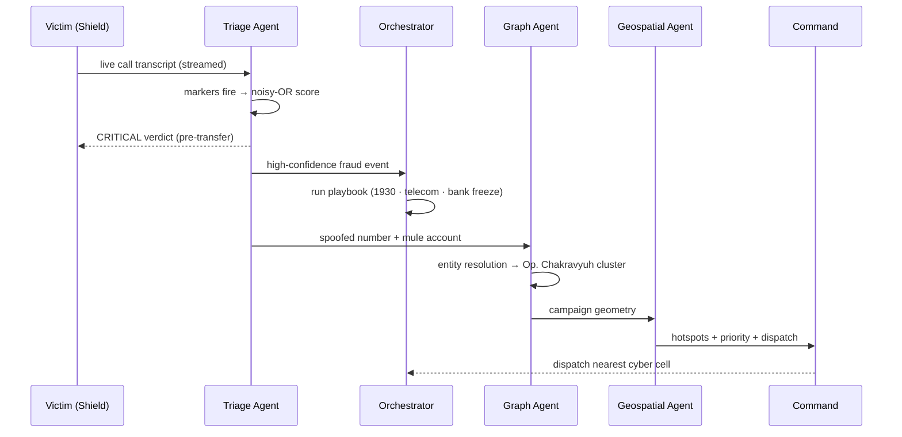
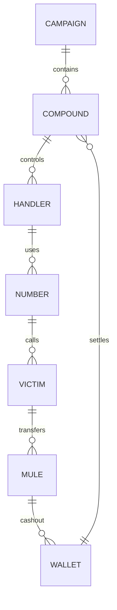

# Prahari — Architecture

Prahari is a **multi-agent intelligence fabric** with three human-facing surfaces (Shield, Graph, Command) over a shared knowledge graph. The demo runs the AI core in-process (TypeScript) so it works offline; the production topology below externalises each agent as a service.

---

## 1. System architecture

## 2. The agent mesh

Six specialised agents reason over the shared graph and coordinate on the signal bus. Each emits **structured, auditable** events — never opaque actions.

| Agent | Responsibility | Key output |
|---|---|---|
| **Triage** | Classifies a live call/message against the digital-arrest playbook; fuses weighted markers via noisy-OR | Risk band + verdict + signal breakdown |
| **Graph** | Entity resolution across numbers/accounts/devices/victims; centrality & community detection | Campaign clusters, key actors, money trail |
| **Geospatial** | Hotspot attribution, enforcement prioritisation, nearest-unit dispatch | Priority queue, dispatch orders |
| **Counterfeit** | On-device CV over security features (thread, intaglio, watermark, latent, serial) | Authenticity score + feature checklist |
| **Compliance / RAG** | Retrieves applicable statutes (BNS, IT Act, PMLA) and NCRB reporting rules with citations | Statute mapping, evidence package skeleton |
| **Orchestrator** | Executes response playbooks with human escalation gates above blast-radius thresholds | Telecom block, bank freeze, 1930 filing |

**Communication:** publish/subscribe on the signal bus with a shared schema; the graph is the source of truth. A Triage `high-confidence` event triggers the Graph agent to attach the entity to a campaign, which triggers the Geospatial agent to update the threat surface — the same fan-out the demo shows live.

## 3. Data flow — the demo spine

## 4. Knowledge-graph model

Entities carry `score` (ring-membership confidence), `centrality`, timestamps and flags. Money edges carry `amount`, enabling the traced-exposure and money-trail computations shown in the intelligence package.

## 5. Scalability & availability

- **Stateless surfaces.** All three UIs are stateless renderers over the fabric; scale horizontally behind the gateway.
- **Per-modality scaling.** Triage (NLP) scales with call volume; Graph scales with campaign size; CV scales at the edge (on-device / bank terminal). Independent autoscaling groups.
- **Signal bus** decouples ingestion spikes (Kafka partitions per source) from agent processing.
- **Graph sharding** by jurisdiction with cross-shard linking for inter-district campaigns.

## 6. Security, privacy & admissibility

- **Chain of custody.** Every source event is content-addressed and append-only in the evidence store; each intelligence package carries an integrity digest (demo shows `sha256:…`).
- **Human-in-the-loop.** The Orchestrator executes only pre-approved playbook steps; anything above a defined blast radius requires human authorisation.
- **Full audit tap** at the gateway — every automated action is logged for legal review.
- **Data minimisation.** Citizen-facing Shield runs classification on-device where possible; PII is tokenised before it enters the graph.
- **Low false positives.** Citizen tools tuned for a sub-1% false-positive rate — the metric that preserves trust.

## 7. Why TypeScript in the demo, FastAPI in production

The judged prototype runs the classifier, graph analytics and CV scoring **in-process in TypeScript** so it launches with one command and zero external dependencies — no cold-start, no API keys, works on a conference Wi-Fi. The contracts (`/api/triage`, the agent event schema) are identical to the production split where each agent is a FastAPI service backed by Claude for open-ended reasoning. Nothing in the UI changes when the core is externalised.
